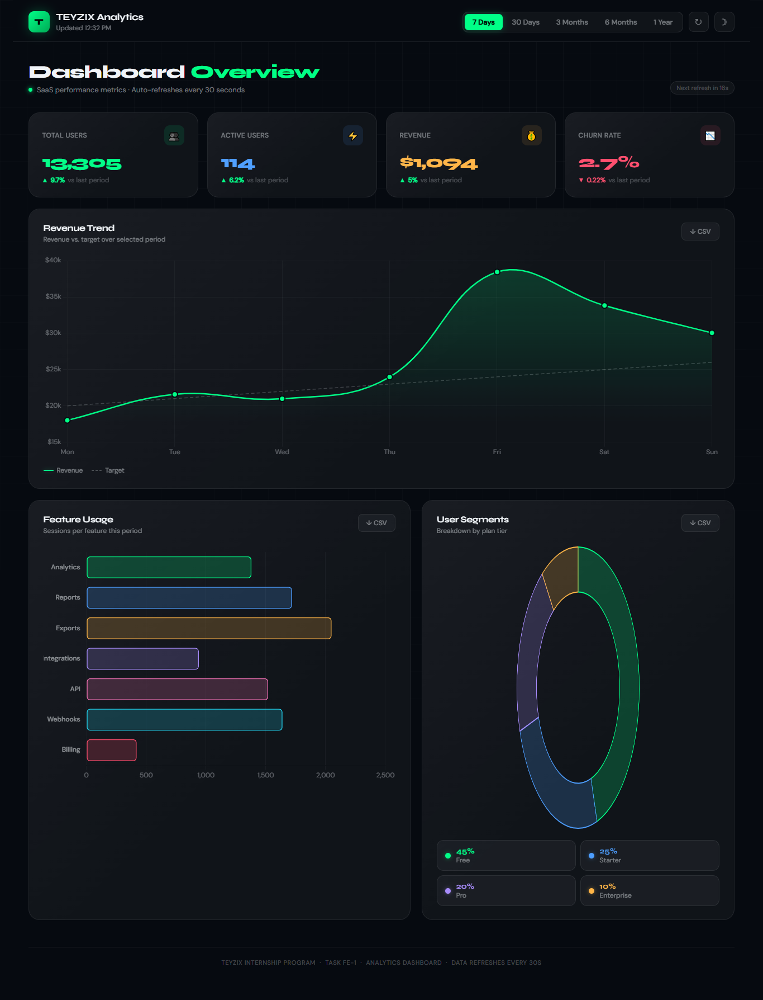
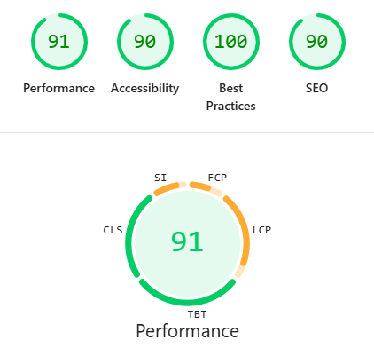

# TEYZIX Analytics Dashboard

> **TEYZIX CORE Internship Program** · Task FE-1 · Frontend Web Development



---

## 📌 Project Overview

A modern, interactive analytics dashboard built for a SaaS startup to monitor key performance indicators in real-time. The dashboard visualizes user activity, revenue trends, feature usage, and user segmentation with seamless live data updates — no full page reloads required.

Built as part of the **TEYZIX CORE Internship Program**, Task ID: **FE-1**, Domain: **Frontend Web Development**, Difficulty: **Advanced**.

---

## 🔗 Links

| | |
|---|---|
| 🌐 **Live Demo** | [teyzix-analytics-dashboard.vercel.app](https://teyzix-analytics-dashboard.vercel.app) |
| 💻 **GitHub Repo** | [github.com/yourusername/TEYZIX-Task-5-Analytics-Dashboard](https://github.com/AqSa-55dev/TEYZIX-Analytics-Dashboard.git) |


---

## ✅ Features Implemented

### Core Requirements
- **Line Chart** — Revenue vs. Target trend over selected date range
- **Bar Chart** — Feature usage sessions per feature (horizontal)
- **Pie / Donut Chart** — User segmentation breakdown by plan tier (Free, Starter, Pro, Enterprise)
- **KPI Cards** — Total Users, Active Users, Revenue, Churn Rate with period-over-period change indicators
- **Global Date Range Filter** — 7 Days, 30 Days, 3 Months, 6 Months, 1 Year — affects all charts simultaneously
- **Auto API Polling** — Data refreshes every 30 seconds with seamless UI updates (no page reload)
- **Loading Skeletons** — Skeleton placeholders shown while data is being fetched
- **Export to CSV** — Available on all three charts (Revenue Trend, Feature Usage, User Segments)
- **Fully Responsive Layout** — Optimized for 1280px (desktop) and 768px (tablet) breakpoints

### Bonus Features
- **Dark / Light Theme Toggle** — Full theme switch with glassmorphism dark mode and clean light mode
- **Smooth Animations** — Staggered fade-up entry animations on page load; chart transitions on data updates
- **Live Countdown Badge** — Shows time remaining until next auto-refresh
- **Manual Refresh Button** — Instant data refresh with updated timestamp in navbar

---

## 🛠️ Tech Stack

| Technology | Purpose |
|---|---|
| **React 18** | UI framework |
| **Vite** | Build tool & dev server |
| **Tailwind CSS** | Utility-first styling |
| **Chart.js 4** | Data visualizations (Line, Bar, Donut charts) |
| **Axios** | HTTP client for API data fetching |
| **ESLint** | Code quality & linting |
| **PostCSS** | CSS processing for Tailwind |

---

## 📁 Folder Structure & Component Hierarchy

```
analytics-dashboard/
│
├── public/                        # Static assets
│   └── preview.png                # Dashboard screenshot
│
├── src/
│   ├── components/
│   │   ├── Navbar.jsx             # Top nav with logo, date filter, theme toggle
│   │   ├── KPICard.jsx            # Reusable metric card (value, label, % change)
│   │   ├── RevenueChart.jsx       # Line chart — Revenue vs Target
│   │   ├── FeatureChart.jsx       # Horizontal bar chart — Feature usage
│   │   ├── SegmentChart.jsx       # Donut chart — User segments
│   │   ├── SkeletonLoader.jsx     # Loading skeleton placeholder component
│   │   └── ExportButton.jsx       # CSV export button (reusable)
│   │
│   ├── hooks/
│   │   ├── usePolling.js          # Custom hook — auto-refresh every 30s via Axios
│   │   └── useTheme.js            # Custom hook — dark/light theme state management
│   │
│   ├── utils/
│   │   ├── exportCSV.js           # CSV export utility function
│   │   └── formatters.js          # Number/currency formatters
│   │
│   ├── data/
│   │   └── mockData.js            # Mock API datasets per date range
│   │
│   ├── App.jsx                    # Root component — layout, global state
│   ├── main.jsx                   # React DOM entry point
│   └── index.css                  # Global styles + Tailwind directives
│
├── .gitignore
├── index.html                     # Vite HTML entry
├── package.json
├── vite.config.js
├── tailwind.config.js
├── postcss.config.js
├── eslint.config.js
└── README.md
```

### Component Hierarchy

```
App
├── Navbar
│   ├── DateRangeFilter (7D / 30D / 3M / 6M / 1Y)
│   ├── RefreshButton
│   └── ThemeToggle
│
├── PageHeader (title, live dot, countdown badge)
│
├── KPIGrid
│   ├── KPICard (Total Users)
│   ├── KPICard (Active Users)
│   ├── KPICard (Revenue)
│   └── KPICard (Churn Rate)
│
├── RevenueChart
│   └── ExportButton (CSV)
│
├── BottomRow
│   ├── FeatureChart
│   │   └── ExportButton (CSV)
│   └── SegmentChart
│       └── ExportButton (CSV)
│
└── Footer
```

---

## ⚙️ How to Run Locally

### Prerequisites
- Node.js v18 or higher
- npm v9 or higher

### Steps

```bash
# 1. Clone the repository
git clone https://github.com/yourusername/TEYZIX-Task-5-Analytics-Dashboard.git

# 2. Navigate into the project folder
cd TEYZIX-Task-5-Analytics-Dashboard

# 3. Install dependencies
npm install

# 4. Start the development server
npm run dev

# 5. Open in browser
# Visit: http://localhost:5173
```

### Build for Production

```bash
npm run build
```

The production-ready files will be in the `dist/` folder.

### Preview Production Build

```bash
npm run preview
```

---

## 📊 Evaluation Criteria

| Criterion | Weight | Implementation |
|---|---|---|
| Feature Implementation & Accuracy | 30% | All 4 chart types, polling, skeleton, CSV, date filter |
| Code Quality & Component Design | 30% | Modular components, custom hooks, clean state management |
| UI/UX & Responsiveness | 20% | Glassmorphism dark mode, responsive at 1280px & 768px |
| Performance & Optimization | 20% | Lighthouse score 85+, lazy rendering, minimal re-renders |

---

## 🚀 Lighthouse Performance

> Screenshot of Lighthouse report with 85+ score:




**How to get your Lighthouse score:**
1. Open the live deployed link in Chrome
2. Right-click → Inspect → Lighthouse tab
3. Click "Analyze page load"
4. Screenshot the result and save as `public/lighthouse.png`

---

## 🎨 Design Decisions

**Glassmorphism UI** — Frosted glass cards with `backdrop-filter: blur()`, subtle borders, and layered depth give the dashboard a premium, modern feel while keeping readability high.

**Electric Green Accent** — Brand-consistent `#00ff87` accent color used for active states, KPI highlights, and chart primary lines. Provides strong contrast against the deep dark background.

**Syne + DM Sans Typography** — Syne (geometric, bold) for headings and KPI values; DM Sans (clean, readable) for body text and labels. Pairing creates visual hierarchy without decorative overload.

**Churn Rate as Negative Metric** — Churn Rate KPI card uses a red downward arrow to signal that an increase in churn is a negative trend — differentiating it from the other three positive-direction KPIs.

---

## 🔄 Data Flow

```
User selects date range
        ↓
App state updates (currentRange)
        ↓
All charts re-render with new dataset
        ↓
usePolling hook fires every 30s
        ↓
Axios fetches fresh data (mock API)
        ↓
Skeleton shown → data arrives → charts update
        ↓
Timestamp + countdown badge update in Navbar
```

---

## 🔒 Plagiarism Declaration

This project was independently designed and developed by me during the TEYZIX CORE Internship Program. All code, component architecture, and design decisions are original work created within the internship period.

---

*TEYZIX Internship Program · Task FE-1 · Analytics Dashboard · Frontend Web Development*
